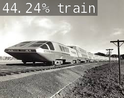

# Traffic Detector


Traffic Detector is an AI that can be used to help self-driving AIs determine certain features of traffic.

## The Algorithm
Traffic Detector uses a pre-trained imagenet model to identify five different types of traffic that may be encountered on the road. They include:
* Bus
* Car
* Motorcycle
* Train
* Truck

## Running this project
1. Download an image from the internet, for example:
    ```sh
    wget "https://example.com/image" -O image.jpg
    ```

2. Run `python3 main.py image.jpg` to classify the image, or
    
    Run `python3 main.py image.jpg --save` to save a new image similar to the [cover image](./cover_art.jpg)


> View more example classified images in the [gallery](./examples/README.md).

### Training your own model
To train your own model, you must first build `jetson-inference` as a prerequisite ([Follow steps here](https://github.com/dusty-nv/jetson-inference/blob/master/docs/building-repo-2.md)).

Next, unzip and upload the following [**data set**](https://www.kaggle.com/datasets/mrtontrnok/5-vehichles-for-multicategory-classification) to the folder `jetson-inference/python/training/classification/data/cars_type`.

Also, move [`model/labels.text`](model/labels.txt) to the folder as well.

The file structure `.../cars_type/` should look like this:
```
test/
train/
val/
labels.txt
```

**Be careful as some of the images in the model are corrupted, so you will need to delete some files!**

Next, run these commands in the `jetson-inference` folder:
```sh
cd jetson-inference
echo 1 | sudo tee /proc/sys/vm/overcommit_memory
./docker/run.sh
cd python/training/classification/
python3 train.py --epochs=16 --batch-size=2 --model=models/cars_type data/cars_type
python3 onnx_export.py --model-dir=models/cars_type
```
> Epochs and batch size are reduced here to lower training times. The actual model was trained using 35 epochs and 8 mini-batches.

The model should be located in `python/training/classification/models/cars_type/resnet18.onnx`.

You can then copy the model into `model/resnet18.onnx`, for example, using this command:
```sh
cp ../jetson-inference/python/training/classification/models/cars_type/resnet18.onnx model/resnet18.onnx
```

[**View a video explanation here**](https://www.youtube.com/watch?v=fwkFNOjE3E0)