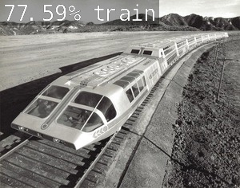

# Traffic Detector

## The Algorithm
Traffic Detector uses a pre-trained imagenet model to identify five different types of traffic that may be encountered on the road. They include:
* Bus
* Car
* Motorcycle
* Train
* Truck

## Running this project
1. Add steps for running this project.
2. Make sure to include any required libraries that need to be installed for your project to run.

[View a video explanation here](video link)